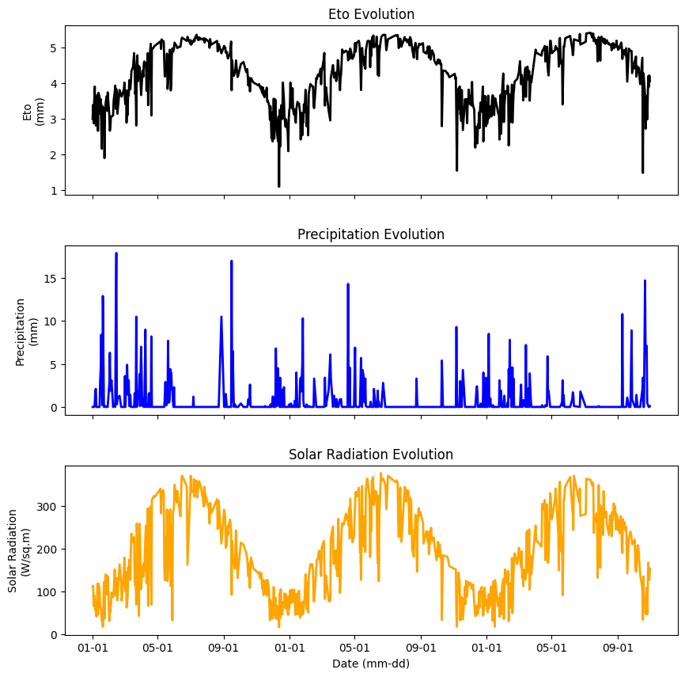
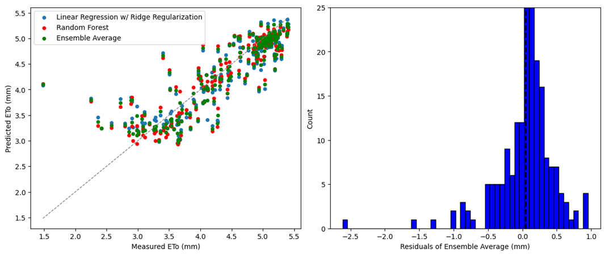
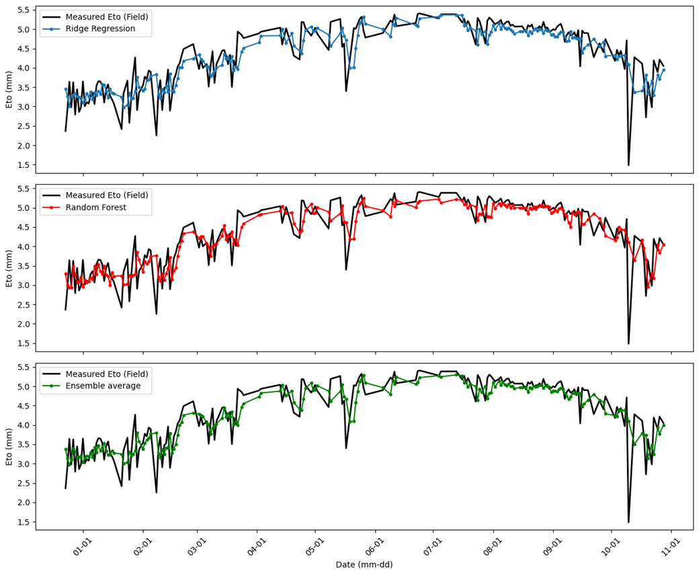
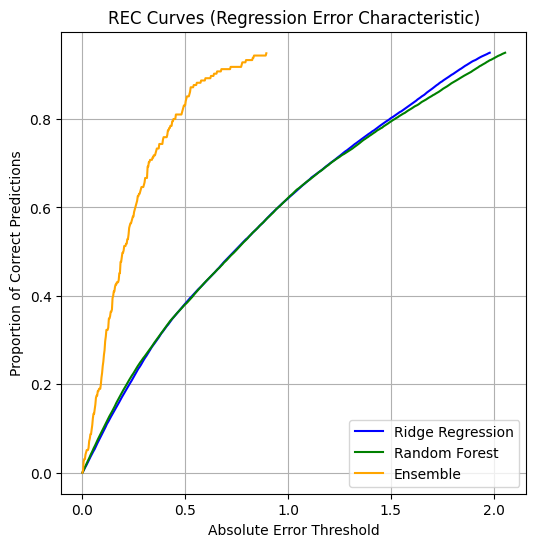

### FORECASTING REFERENCE EVAPOTRANSPIRATION (ETo) USING MACHINE LEARNING TECHNIQUES, IN CALIFORNIA ###

## My Project

In this project, I applied machine learning techniques to explore and predict Reference Evapotranspiration (Eto), using in-situ data from a CIMIS station. CIMIS stands for California Irrigation Management Information System, and according to their website, it can be described as a program within the Water Use and Efficiency Branch of the California Department of Water Resources (DWR), that oversees a network of more than 145 automated weather stations across California. It was established in 1982 through a collaboration between DWR and the University of California, Davis (UC Davis), CIMIS was created to help irrigation managers optimize water resource usage. By promoting efficient water use, the program helps conserve water, energy, and financial resources for Californians.

Therefore, given my background as a Civil Engineer currently working in irrigation and water resources management, learning Machine Learning techniques will help me find solutions to water scarcity problems more efficiently. 

## Introduction 

Evapotranspiration (ET) refers to the water lost to the atmosphere through the combined processes of evaporation from soil and plant surfaces and transpiration from plant tissues. Reliable ET estimates are essential for multiple purposes. In fields such as agricultural and landscape irrigation, these estimates are highly important for system design, irrigation scheduling, water rights, water transfers, water resources planning, and other water management concerns (California Irrigation Management Information System, CIMIS, 2024). In this context, there is Reference Evapotranspiration (ETo), which is derived by measuring weather conditions and estimating the ET of a reference plant. In California this is a standardized planted surface of well-maintained cool season turf (UCANR, 2024).

Nonetheless, in developing countries, measuring ETo is not always possible, therefore, we rely on Machine Learning (ML) techniques to calculate Eto. In other words, in many regions, in-situ data on weather parameters such as temperature, humidity, and wind speed may be scarce or difficult to obtain. Machine learning models can be trained using available data from nearby weather stations or remote sensing, helping to fill in these data gaps, providing another way to estimate ETo, enabling better water management and irrigation practices without the need for a dense network of physical sensors. 

The primary goal was to develop a model that could accurately predict Eto, a key factor in agriculture and water management. By using historical data, I trained two machine learning models to identify patterns and relationships between these variables. I specifically used supervised learning techniques because the dataset includes both input variables (precipitation, solar radiation) and a target variable (Eto). This allowed me to apply regression methods to predict the target variable based on known inputs.

## Data

The dataset used in this project is a comprehensive set of historical meteorological daily data from 2019 until 2021 (full years). It includes the following key variables (represented in Figure 2 below):

•	ETo (Reference Evapotranspiration): The target variable, representing the amount of water evaporated and transpired by plants, as mentioned in section 1 of this project.

•	Precipitation (Precip): The amount of rainfall recorded, which directly affects soil moisture and plant water availability.

•	Solar Radiation (Sol Rad): The amount of solar energy received, which influences plant growth and evapotranspiration rates.

The data spans 3 years, providing a rich historical record of environmental conditions. The dataset contains variables such as precipitation, solar radiation, net radiation, air temperature, etc., and the target variable (ETo), making it suitable for supervised machine learning models. The dataset was extracted from a CIMIS station located in Alturas, California (see Figure 1, highlighted in red): 

{: width="500" }

*Figure 1. Location of the CIMIS station in Alturas, CA.*

The dataset is highly relevant for machine learning because it exhibits both linear and non-linear relationships in the target variable. By analyzing these patterns using machine learning, I aimed to create an accurate predictive model for Eto. The machine learning models used in this project were chosen to handle the complexities in the dataset effectively.

{: width="500" }

*Figure 2. Data included in the analyzed dataset, being ETo the target variable.*

## Modelling

The main objective of the analysis is to predict reference evapotranspiration (ETo), which is a key variable in understanding water needs for crops and ecosystems, as mentioned before. ETo is the amount of water that would evaporate and transpire from a reference crop, under optimal conditions. This analysis focused solely on predicting this variable, and other variables were not included in the model.
The first step involved data preprocessing, where the dataset was cleaned to remove any outliers. The interquartile range (IQR) method was applied to identify and remove extreme values that could distort our model’s performance.

Next, the ETo values were transformed using a logarithmic scale. This transformation was particularly useful for handling zero or very small values in the dataset, which can lead to issues during modeling, especially with regression algorithms that cannot handle zero values directly. The log-transformation helped in stabilizing the variance and making the data more suitable for modeling.
Before modeling, the data was analyzed through some exploratory techniques:

•	Histograms were plotted to check the distribution of ETo values, helping to identify whether the data followed a normal distribution or if there were skewed patterns.

•	Boxplots were also used to visualize the presence of outliers, providing a quick way to understand the spread of the data and identify any data points that were extreme.

Since ETo is a time-dependent variable, the analysis included the creation of lag features. These lag features captured temporal dependencies in the data, such as how previous values of ETo can influence future predictions. The lag features were created by shifting the ETo variable across different time periods (previous days), which helps the model understand patterns over time.

4.1.	Ridge Regression

First, Ridge regression was chosen due to its effectiveness in handling multicollinearity (correlated predictors). This is common when working with time-series data, where predictors may be highly correlated. Ridge regression applies L2 regularization, which penalizes large coefficients and helps prevent overfitting, a common problem in regression models with many features.
The model was evaluated using Root Mean Squared Error (RMSE), a standard metric for regression that measures the average magnitude of error in predictions. Lower RMSE values indicate better model performance.

4.2.	Ridge Regression with K-folds

To assess the performance of Ridge regression and ensure it generalized well to unseen data, k-fold cross-validation was applied. This method divides the dataset into k subsets (folds), training the model on k-1 folds and testing it on the remaining fold. This process is repeated for each fold, providing a more robust evaluation of the model’s performance.
Therefore, cross-validation helps mitigate the risk of overfitting and ensures that the model’s performance is assessed on different subsets of the data. The RMSE values for each fold are then obtained to summarize the overall performance.

4.3.	Random Forest

Random Forest is an ensemble learning method that constructs multiple decision trees and aggregates their predictions. Each tree is built using a random subset of the data and a random subset of features, which helps increase the model's generalizability and robustness.

Random Forest was chosen as a more flexible, non-linear model capable of handling complex relationships between features. It creates an ensemble of decision trees, trained on different subsets of the data, and captures interactions between features.

In the analysis, a Random Forest model was trained to predict ETo, using a pipeline that included feature scaling through the Standard Scaler and model training with “RandomForestRegressor”. The model was configured with 50 decision trees, a maximum depth of 8 for each tree, and the square root of the total number of features considered for each split. 
Out-of-bag samples were used to estimate the generalization error, ensuring the model's performance was robust. After handling outliers in the dataset, the model was retrained on the cleaned data. The root mean squared error (RMSE) was calculated to assess model accuracy, yielding a value of RMSE for Random Forest with outliers handled. This value provided an indication of the model's predictive performance when tested on unseen data.

4.4.	Ensemble Average

To improve predictive accuracy, an ensemble approach was applied by combining the predictions of both the Ridge regression and Random Forest models. By taking a weighted average of their predictions, the ensemble method aimed to reduce model bias and variance, potentially leading to better overall performance.

## Results

First, Table 1 shows the RMSE values of all models when applied to the test data. The use of K-Folds cross-validation had a minimal effect on model performance, with an RMSE change of less than 1x10^-3 mm. The Ridge Regularization (LR) models demonstrated significantly lower RMSE values compared to the Random Forest (RF) model. 

Link to table here: 

On the other hand, Figure 3 compares the predicted and measured ETo, along with the residuals. The mean of the residuals for the ensemble average was very close to zero (0.042), and the residuals showed a left skew, which means that the mean is less than median, in this case. Figure 4 displays the predicted Eto values from the ML models over time, providing an initial assessment of the model’s ability to replicate ETo patterns.

{: width="500" }
*Figure 3. Scatterplot showing predicted v observed ETo values on the left. On the right, a histogram of the residuals when using the ensemble average approach. The average residual equals 0.042.*

{: width="500" }
*Figure 4. Figure 4. Measured and ML ETo results comparison.*

5.1.	Models Performance

For model performance purposes, the Regression Error Characteristic (REC) curves were calculated to evaluate the performance of the models—Ridge Regression, Random Forest, and an Ensemble model—across a range of prediction errors. The purpose was to assess how the models behave when allowed different levels of error and to compare their performance.
The process began by calculating the absolute errors between the predicted and actual values. A threshold was then set, which represented the maximum allowable error, and the proportion of correct predictions within that threshold was computed. This calculation was repeated for a series of thresholds, providing a detailed view of how well each model predicted the values at different error tolerances.

The results were plotted to show the REC curves for each model. These curves illustrate the proportion of correct predictions as the error threshold increases. 

By comparing the curves for Ridge Regression, Random Forest, and the Ensemble model, insights were gained into which model provided more accurate predictions across varying levels of acceptable error. The curves were also used to visualize the trade-offs between model accuracy and error tolerance, providing a more nuanced understanding of model performance.

{: width="500" }
*Figure 5. REC curves for model performance.*

5.2.	Accuracy 
After the REC curves analysis, an accuracy analysis was carried out to assess how well each model predicted the values within a specified tolerance range. The objective was to measure the proportion of correct predictions, defined as those where the predicted values were within a certain percentage tolerance of the actual values. A tolerance of 5% was used for this evaluation.

The accuracy for each model was computed by comparing the predicted values to the actual test data and determining how many predictions fell within the specified tolerance, which in this case is 5%. The results are presented as a percentage of correct predictions. The accuracy of the Ridge Regression model, Random Forest, and the Ensemble model were all calculated and compared, being Random Forest the most accurate of them all. The Ensemble model, which combined the predictions from both Ridge Regression and Random Forest, was also evaluated to determine if it provided a more accurate prediction than the individual models, resulting in an overall accuracy of 51.28%. Complete result can be shown in Table 2. 

If the tolerance threshold increase, the accuracy will also increase, as shown in Table 3. 

## Discussion

In this project, the main goal was to predict Reference Evapotranspiration (ETo) using some machine learning models, specifically Ridge Regression and Random Forest. The results showed that Ridge Regression, especially with K-Folds cross-validation, provided significantly lower Root Mean Squared Error (RMSE) values compared to the Random Forest model. This indicates that Ridge Regression was more effective in accurately predicting Eto, based on the input variable such as ‘in-situ; ETo data.

The minimal effect of K-Folds cross-validation on the RMSE suggests that the model was already efficient and generalizable to unseen data. The ensemble average approach also yielded promising results, with a mean residual close to zero, indicating that the model's predictions were well-aligned with the actual observed values. The left-skewed distribution of residuals suggests that while the model performed well overall, there may be instances where it underestimates ETo.

On the other hand, the REC curves illustrated the proportion of correct predictions made by each model as the error threshold varied. For instance, the curves for Ridge Regression consistently remained above those of the Random Forest model across a range of error thresholds, this would indicate that Ridge Regression was more effective at making accurate predictions of ETo. This also suggests that Ridge Regression was better suited for the task, as it could provide reliable estimates even when small margins of error were considered.

In particular, the curves showed that Ridge Regression maintained a high proportion of correct predictions at slightly lower error thresholds, this performance indicates that the model could effectively capture the underlying patterns in the data, leading to more accurate ETo predictions. Conversely, if the Random Forest model exhibited also a slightly lower proportion of correct predictions, it would suggest that it struggled to generalize from the training data to make accurate predictions on unseen data.

The Ensemble model, which combined the predictions from both Ridge Regression and Random Forest, would ideally show an improvement in performance over the individual models. The REC curve for the Ensemble model was consistently higher than those of the individual models, it would indicate that this approach successfully leveraged the strengths of both models, resulting in more accurate ETo predictions. This would be particularly beneficial in practical applications, as it could provide a more accurate solution for irrigation managers who are facing the challenges of water resource management.

Overall, the results can be beneficial for irrigation managers and agricultural stakeholders, as accurate ETo predictions can lead to better water management practices and improved crop yields.

## Conclusion

In conclusion, this project could help to demonstrate the application of machine learning techniques to predict Reference Evapotranspiration (ETo) using historical data. The Ridge Regression model outperformed the Random Forest model, showcasing its effectiveness in handling the complexities of the dataset. The use of K-Folds cross-validation further validated the model's performance, ensuring its reliability for real-world applications.

The insights gained from this analysis can significantly contribute to water resource management in agriculture. By providing accurate ETo predictions, irrigation managers can optimize water usage, leading to more sustainable agricultural practices. The project underscores the potential of machine learning in addressing environmental challenges, particularly in the context of water scarcity.
Future work could explore additional machine learning models and techniques, as well as incorporate more variables that may influence ETo. Continuous improvement in predictive modeling will be essential for adapting to changing environmental conditions and ensuring the sustainability of agricultural practices.

## References

1.	Bijlwan, A., Pokhriyal, S., RANJAN, R., Singh, R. K., & Jha, A. (2024). Machine learning methods for estimating reference evapotranspiration. Journal of Agrometeorology, 26(1), 63-68.
2.	California Irrigation Management Information System (CIMIS) (2024). Overview. URL: https://cimis.water.ca.gov/ . Retrieved on 12/01/2024.
3.	Feng, Y., Cui, N., Gong, D., Zhang, Q., & Zhao, L. (2017). Evaluation of random forests and generalized regression neural networks for daily reference evapotranspiration modelling. Agricultural Water Management, 193, 163-173.
4.	Hargreaves, G. H. (1994). Defining and using reference evapotranspiration. Journal of irrigation and drainage engineering, 120(6), 1132-1139.
5.	Hart, Q. J., Brugnach, M., Temesgen, B., Rueda, C., Ustin, S. L., & Frame, K. (2009). Daily reference evapotranspiration for California using satellite imagery and weather station measurement interpolation. Civil Engineering and Environmental Systems, 26(1), 19-33.
6.	Malik, A., Jamei, M., Ali, M., Prasad, R., Karbasi, M., & Yaseen, Z. M. (2022). Multi-step daily forecasting of reference evapotranspiration for different climates of India: A modern multivariate complementary technique reinforced with ridge regression feature selection. Agricultural Water Management, 272, 107812.
7.	Shiri, J. (2018). Improving the performance of the mass transfer-based reference evapotranspiration estimation approaches through a coupled wavelet-random forest methodology. Journal of Hydrology, 561, 737-750.
8.	UCANR (2024). ETo Irrigation. URL: https://ucanr.edu/sites/UCLPIT/Methods/ETo_Irrigation/ Retrieved on 12/01/2024. 

